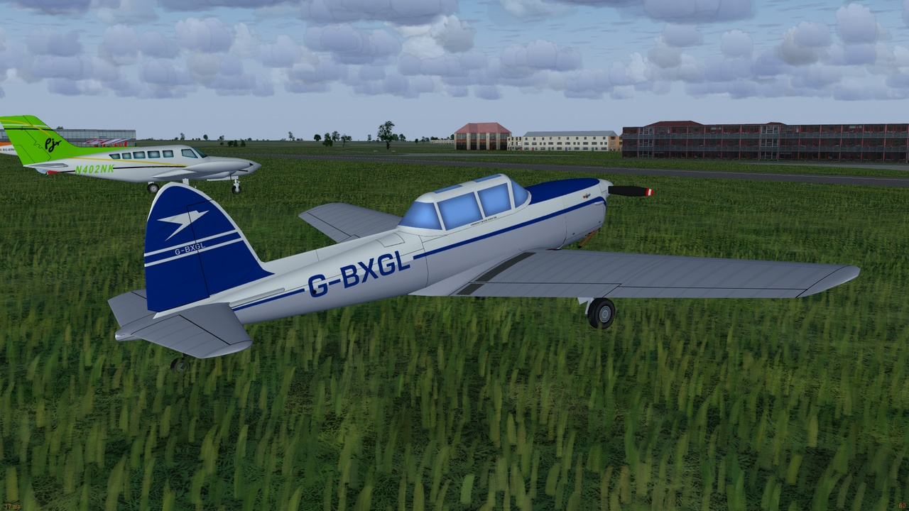
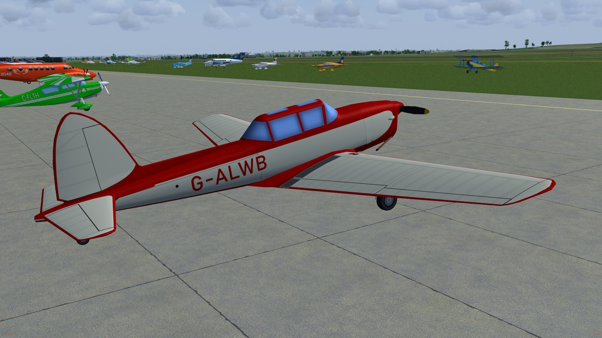
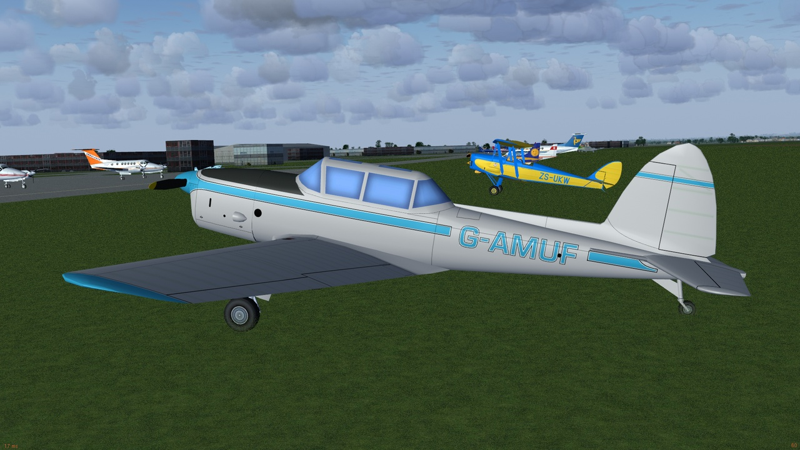
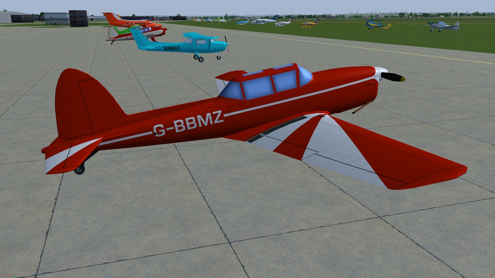
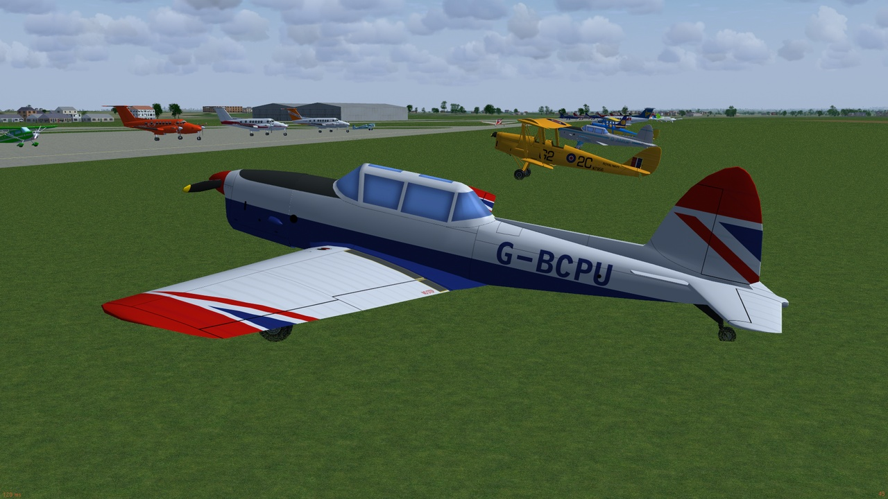
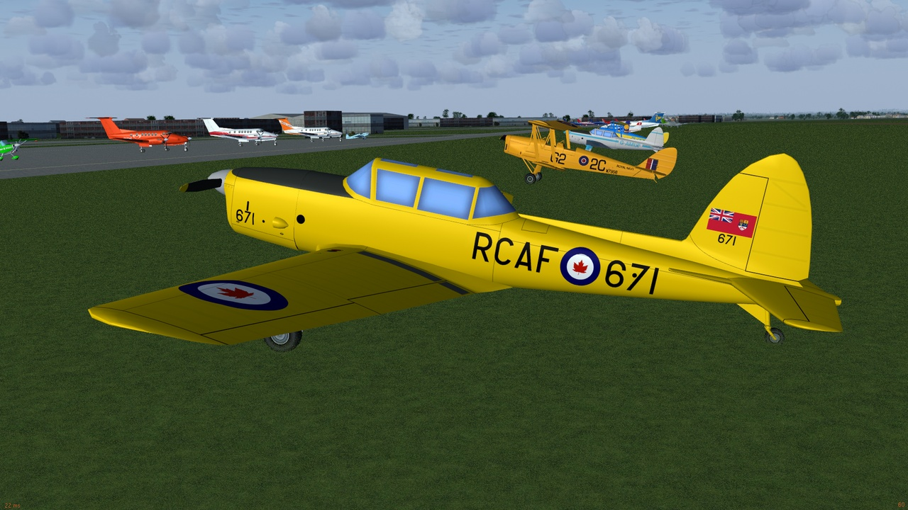

# DHC-1 Chipmunk
### AI Aircraft for FlightGear
(Work In Progress but usable)

Download the zip file and extract the "DHC-1" folder into the "$FG_ROOT/AI/Aircraft" folder.

To use you will need to create a traffic file, see the wiki for instructions.
 http://wiki.flightgear.org/AI_Traffic

A simple AI Traffic Creator (Python and a 64 bit windows) is available here: 
https://github.com/gooneybird47/FlightGear-AI-Traffic-Creator