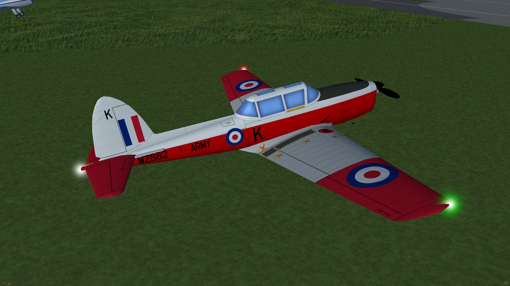
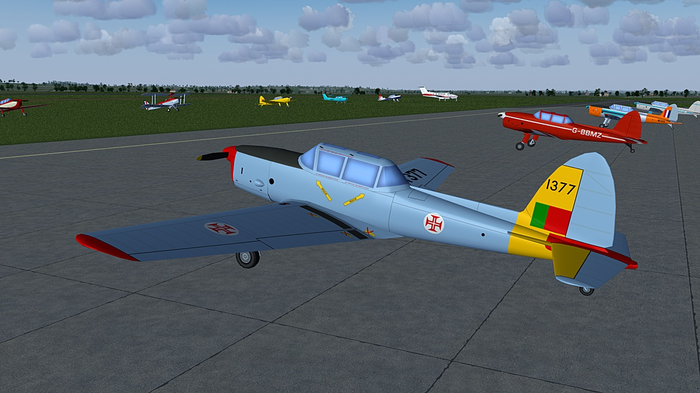
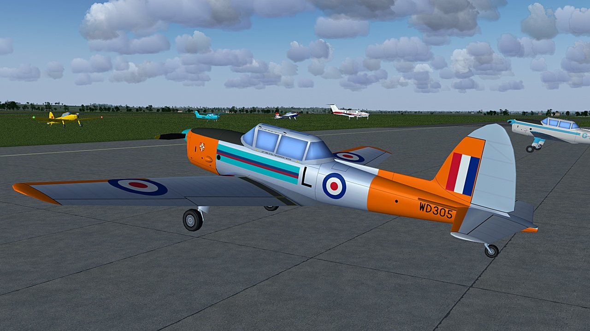

# DHC-1 Chipmunk
### AI Aircraft for FlightGear

chippy-WZ882

chippy-G-BXGL

chippy-G-ALWB

chippy-G-AMUF

chippy-G-BBMZ

chippy-G-BCPU

chippy-RCAF-G-BNZC

chippy-1377

chippy-WD305

Download the zip file and extract the "DHC-1" folder into the "$FG_ROOT/AI/Aircraft" folder.

To use you will need to create a traffic file, see the wiki for instructions.
 http://wiki.flightgear.org/AI_Traffic

A simple AI Traffic Creator (Python and a 64 bit windows) is available here: 
https://github.com/gooneybird47/FlightGear-AI-Traffic-Creator